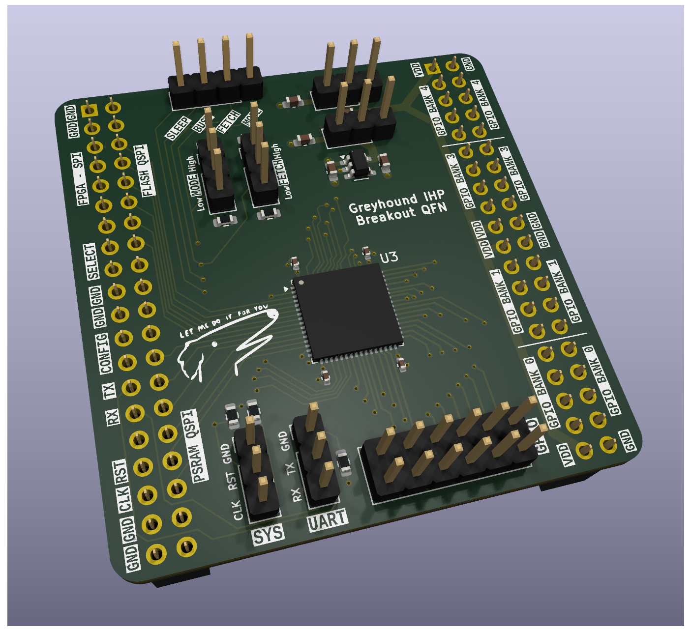

# Greyhound Breakout PCB

This repository holds the breakout PCB for [Greyhound](https://github.com/mole99/greyhound-ihp).
It was designed for [Greyhound v1](https://github.com/mole99/greyhound-ihp-v1) taped out on 07 Apr 2025, SG13G2.

It is based on the [Tiny Tapeout breakout](https://github.com/TinyTapeout/breakout-pcb) board. Thanks a lot!

The PCB was designed with KiCad version 9.0.

Check out the project in your browser using KiCanvas: [Greyhound Breakout PCB](https://kicanvas.org/?github=https://github.com/mole99/greyhound-main-pcb/blob/main/greyhound-main-pcb.kicad_pro)

# License

The PCB is licensed under the Apache 2 License
